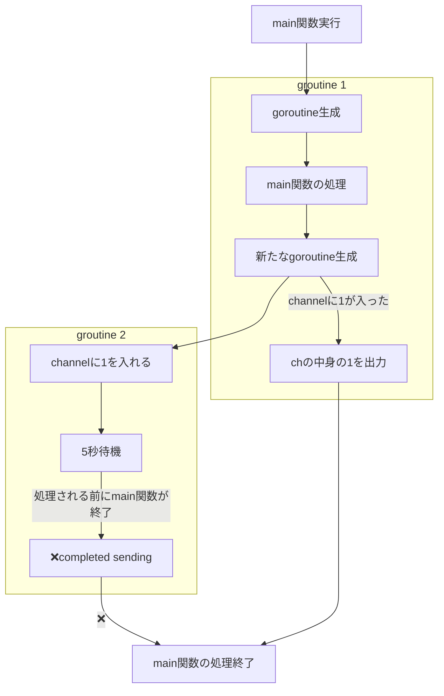
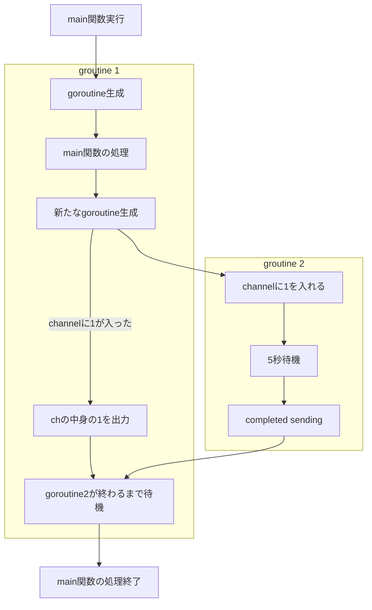

# Overview

ゴルーチンやチャネルについて

# channelの送信側と受信側の動作

channelにbufferが設定された場合とされてない場合の動作の違いについて説明する。

## channelにbufferが設定されていない場合

- 受信側の処理(<-ch)は送信側がchannelにデータを入れる(ch <- 1)までブロックされる
- 送信側の処理(ch <- 1)は受信側が値を受け取る(<-ch)までブロックされる

**sample code**
```go
func main() {
    ch := make(chan int)

    go func() {
        ch <- 1 // <-ch が実行されるまで処理は進まない
        fmt.Println("completed sending")
    }

    fmt.Println(<-ch) // ch <- 1 でchannelに値が入るまで処理は進まない
}
```

**output**
```sh
# fmt.Println("completed sending") の処理が重い処理ではないため下記の順序に出力される
completed sending
1
```

例えば、以下のように`ch <- 1`以降の処理を重くすると

```go
func main() {
    ch := make(chan int)

    // goroutine2が生成される
    go func() {
        ch <- 1 // <-ch が実行されるまで処理は進まない
        time.Sleep(5 * time.Second)
        fmt.Println("completed sending")
    }

    fmt.Println(<-ch) // ch <- 1 でchannelに値が入るまで処理は進まない
}
```

```sh
# 受信側の処理しか出力されない
1
```

これは`main()`が実行された際に生成されるメインのgoroutineが新たに生成したgoroutineの処理を待たずに処理を終了させてしまうため起こる。



Go の main() は "メインゴルーチン" として動作し、main() の処理が終了すると、すべてのゴルーチンが強制終了する。

そのため、`sync.WaitGroup` を使用してゴルーチンの完了を待つことで、main() の終了を防ぐ。

```go
func main() {
	// with no buffer
	ch := make(chan int)
	var wg sync.WaitGroup
	wg.Add(1) // 処理を待つgoroutineの数をセット

    // goroutine2が生成される
	go func() {
		defer wg.Done() // wgのcounterを1減らす
		ch <- 1
		time.Sleep(5 * time.Second)
		fmt.Println("completed sending")
	}()

	fmt.Println(<-ch)

	wg.Wait() // wgのcounterが0になるまで待機
}
```



## channelにbufferが設定されている場合

- 送信側(ch <- 1)の処理はchannelのbufferに空きがあれば、後続の処理に進む
- channelのbufferがいっぱいになった場合、bufferに空きができるまで後続処理を待機
- 受信側(<-ch)はchannelに値が入ってくるまで待機

```go
func main() {
	ch := make(chan int, 3)
	var wg sync.WaitGroup

	wg.Add(1)

	go func() {
		defer wg.Done()

		for i := 0; i < 3; i++ {
			ch <- 1 // bufferに空きがあれば即座に後続の処理に進む
			fmt.Println("sent")
			time.Sleep(1 * time.Second)
		}

		close(ch) // 受信側に値がもう入ってこないことを知らせる
	}()

	for v := range ch { // chがcloseされてない場合、ずっと待ち続けることになる。
		fmt.Println(v)
		fmt.Println("received")
	}

	wg.Wait()
}
```

bufferがあるチャネルを利用している場合、chをcloseしないと受信側でchの送信をずっと待ち続けることになるため注意が必要。
